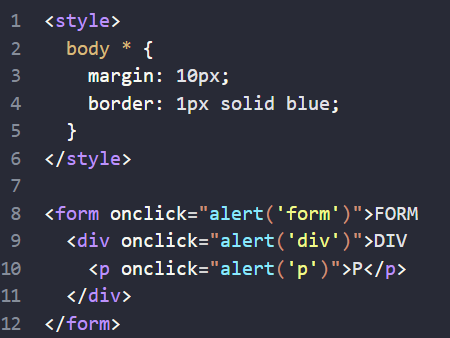
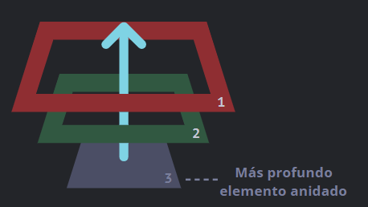
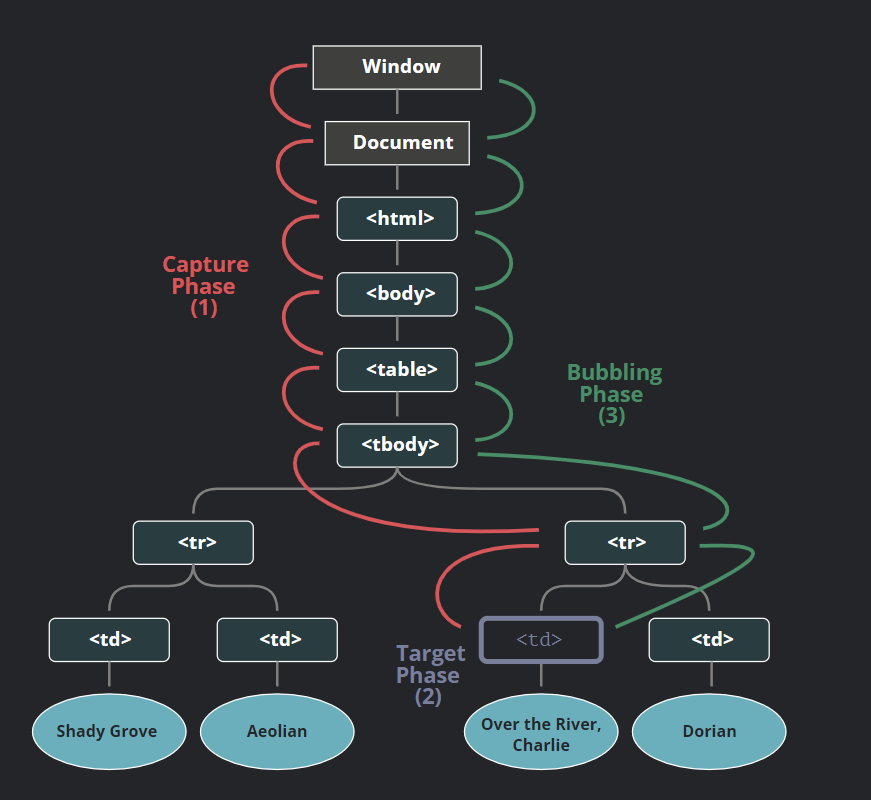
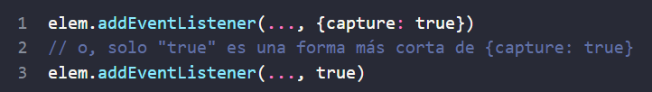
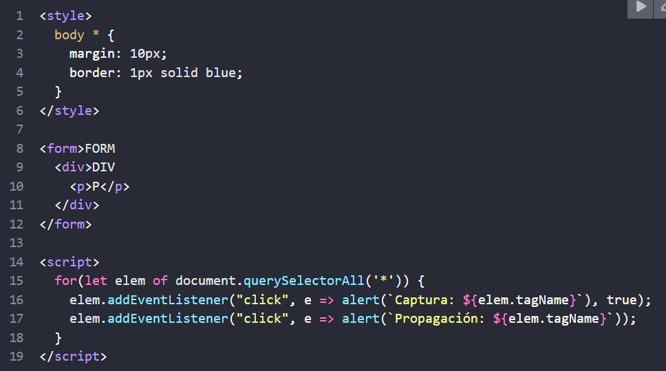

# Propagacion y captura
## Propagacion

El principio de propagación es simple.

Cuando un evento ocurre en un elemento, este primero ejecuta los manejadores que tiene asignados, luego los manejadores de su padre, y así hasta otros ancestros.

Digamos que tenemos 3 elementos anidados FORM > DIV > P con un manejador en cada uno de ellos:

Un clic en el elemento del interior 
 primero ejecuta onclick:

1. En ese 
.
2. Luego en el 
 de arriba.
3. Luego en el <form> de más arriba.
4. Y así sucesivamente hasta el objeto document.

Así si hacemos clic en 
, entonces veremos 3 alertas: p → div → form.

Este proceso se conoce como “propagación” porque los eventos “se propagan” desde el elemento más al interior, a través de los padres, como una burbuja en el agua.

## event.target

Un manejador en un elemento padre siempre puede obtener los detalles sobre dónde realmente ocurrió el evento.

El elemento anidado más profundo que causó el evento es llamado elemento objetivo, accesible como event.target

Nota la diferencia de this (=event.currentTarget):

- event.target – es el elemento “objetivo” que inició el evento, no cambia a través de todo el proceso de propagación.
- this – es el elemento “actual”, el que tiene un manejador ejecutándose en el momento.
Por ejemplo, si tenemos un solo manejador form.onclick, este puede atrapar todos los clicks dentro del formulario. No importa dónde el clic se hizo, se propaga hasta el <form> y ejecuta el manejador.

En el manejador form.onclick:

- this (=event.currentTarget) es el elemento <form>, porque el manejador se ejecutó en él.
- event.target es el elemento actual dentro de el formulario al que se le hizo clic.

[da click en el enlace para ver el ejemplo](https://github.com/RolandoLloveraAlanis/LloveraARo/tree/main/Parcial2/EventoJS/ejemplo)

## Detener la propagacion

Una propagación de evento empieza desde el elemento objetivo hacia arriba. Normalmente este continúa hasta <html> y luego hacia el objeto document, algunos eventos incluso alcanzan window, llamando a todos los manejadores en el camino.

Pero cualquier manejador podría decidir que el evento se ha procesado por completo y detener su propagación.

El método para esto es event.stopPropagation().

## Captura
Hay otra fase en el procesamiento de eventos llamada “captura”. Es raro usarla en código real, pero a veces puede ser útil.

El estándar de eventos del DOM describe 3 fases de la propagación de eventos:

1. Fase de captura – el evento desciende al elemento.
2. Fase de objetivo – el evento alcanza al elemento.
3. Fase de propagación – el evento se propaga hacia arriba del elemento.
Aquí está la imagen de un clic en <td> dentro de una tabla, tomada desde la especificación:

	

Se explica así: por un clic en <td> el evento va primero a través de la cadena de ancestros hacia el elemento (fase de captura), luego alcanza el objetivo y se desencadena ahí (fase de objetivo), y por último va hacia arriba (fase de propagación), ejecutando los manejadores en su camino.

Antes solo hablamos de la propagación porque la fase de captura es raramente usada. Normalmente es invisible a nosotros.

Los manejadores agregados usando la propiedad on<event> ó usando atributos HTML ó addEventListener(event, handler) con dos argumentos no ejecutarán la fase de captura, únicamente ejecutarán la 2da y 3ra fase.

Para atrapar un evento en la fase de captura, necesitamos preparar la opción capture como true en el manejador:

Hay dos posibles valores para la opción capture:

- Si es false (por defecto), entonces el manejador es preparado para la fase de propagación.
- Si es true, entonces el manejador es preparado para la fase de captura.

Es de notar que mientras formalmente hay 3 fases, la 2da fase (“la fase de objetivo”: el evento alcanzó el elemento) no es manejada de forma separada; los manejadores en ambas fases, la de captura y propagación, se disparan en esa fase.

Veamos ambas fases, captura y propagación, en acción:

El código prepara manejadores de clic en cada elemento en el documento para ver cuáles están funcionando.

Si haces clic en 
, verás que la secuencia es:

HTML → BODY → FORM → DIV (fase de captura, el primer detector):
P (fase de objetivo, se dispara dos veces, tan pronto como preparemos los dos detectores: de captura y propagación)
DIV → FORM → BODY → HTML (fase de propagación, el segundo detector).
Hay un propiedad event.eventPhase que nos dice el número de fase en la qué el evento fue capturado. Pero es raramente usada, ya que usualmente lo sabemos en el manejador.
